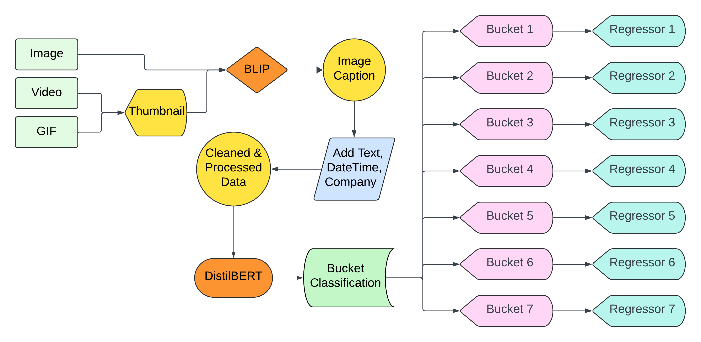
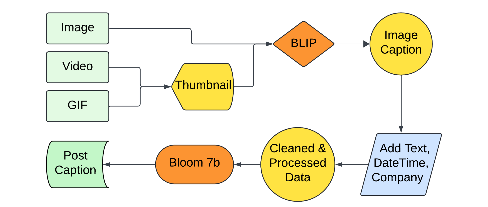

# Adobe-Behaviour-Simulation-Challenge
This repository contains my team's solution for the Mid Prep Problem Statement of InterIIT TechMeet 13.0, **"Adobe Behaviour Simulation Challenge"** by Adobe.

## Data
- **1. Image_Captioning.ipynb:** In this notebook we have downloaded the media files and generate caption for them using **BLIP** model.  
- **2. 100K_Data_Generation.ipynb:** In this notebook we have reduced the length of the actual dataset (300K) and only consider the first 100K samples.  
- **3. Data_Cleaning.ipynb:** In this notebook we have combined the tokenized content text with the generated captions along with their embeddings, and then splitted this into train and test datasets.

## Task 1
- **Tokenization.ipynb:** In this notebook we have tokenized the content (captions) of the given dataset using the **DistilBERT** tokenizer.  
- **Creating_Prompts.ipynb:** In this notebook we have written prompt to convert the data into more organized format for the bucketing process.  
- **Bucketing.ipynb:** In this notebook we have created 7 buckets (classes) and trained the **DistilBERT** model for this classification task.

## Task 2
- **FineTune.ipynb:** In this notebook we have Fine Tuned the **Bloom 7b** and **Qwen 1.5b** models using **LoRA** and **PEFT** techniques. 
- **Inference.ipynb:** In this notebook, using the fine tuned models we have performed predictions on the first 500 samples. 
- **Test_Metrics.ipynb:** In this notebook we have used **BLEU (1-4)**, **ROUGE (1,2,L)** and **CIDEr** metrics to evaluate the model's predictions with the original captions. 

## Team
* [**Ebad Sayed**](https://github.com/ES7)  
* [**Aaditya Jain**](https://github.com/a-aditya-jain)
